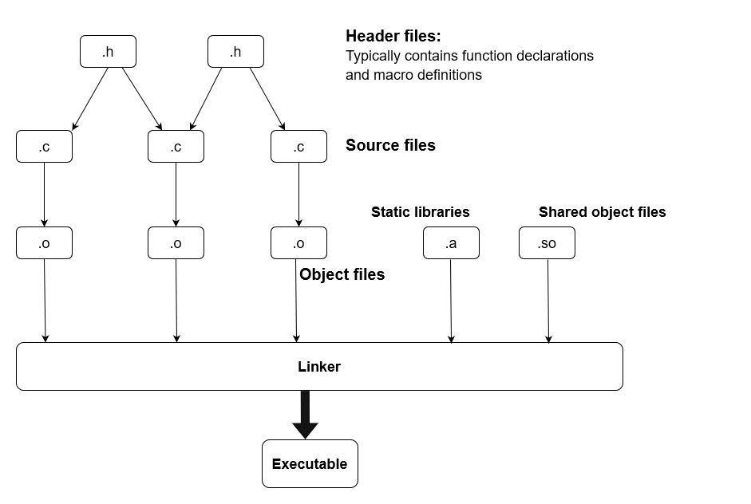
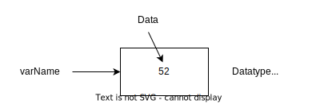
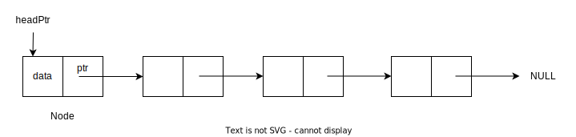
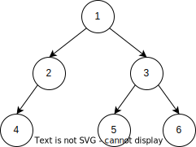
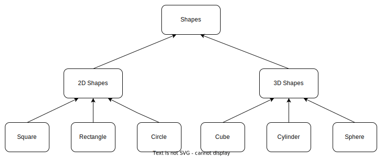

##  Getting started

1.		Mark your attendance
2.		Guest accounts
## Acessing the files
The course material is available on Github. And you can clone the repository using the following command
```console
$ git clone https://github.com/rakesh-rs211/Introduction-to-C.git
```

## Local machine
If you are working on MacOS or Linux, you can download the file and run them on the local machine using 'Terminal'. 
Note: One of the examples uses GSL libraries installed on our software stack. Unless they are already installed on your local system, you will not be able to run this example.

### Magic Castle: Recommended

Instructions to obtain credentials for the guest account are provided on the Moodle page.  In order to connect to the remote cluster, you would need a Terminal(Mac and Linux users) or a Terminal Emulator(Windows).

- [MobaXterm](https://mobaxterm.mobatek.net/download-home-edition.html) for Windows 
- Windows Subsystem Linux
- Powershell
- [Terminal on MacOS](https://support.apple.com/en-ca/guide/terminal/apd5265185d-f365-44cb-8b09-71a064a42125/mac)

```
$ ssh userXXXX@coss-a.c3.ca
$ cd ~/scratch
$ mkdir COSS2024
$ cd COSS2024
$ git clone https://github.com/rakesh-rs211/Introduction-to-C.git
$ cd CourseMaterial
$ ls
CPP  C_SRC
$ cd C_SRC
```
### Interlude: Linux commands
- **cd**: 	change directory
- **ls**:     	list the file and sub-directory in the current working directory
- **mkdir**:	Make a new directory
- **ssh**:	One a secure connection to a remote server using ssh(secure-shell)
- **cat:**	Print content of a file to screen
- **vi, nano**: Text editors

### Interactive session on compute nodes

```
salloc -c 1 --mem=2g --time=2:00:00 
```

## Introduction
- This course is intended as an introduction to programming. 
- Write computationally efficient code and gives low-level access to the hardware
- It was developed by **Dennis Ritchie** at Bell Laborataries for the development of *Unix OS*
- Linux kernel was mostly written in C and rest in assemby language
- Its a powerful programming language and is useful in exploring the fundamental concepts of programming
- Portability and light-weight
- Widely used in embedded programming

### References

1) Deitel H.M. and Deitel P.J., 2015, C: How to Program with introduction to C++, 8th edition.
2) Kernighan B., and Ritchie D., 1988, ANSI C: The C Programming Language, 2nd Edition.
3) Cormen T.H., Leiserson C.E., Rivest R.L., and Stein C., 2022, Introduction to Algorithm, 4th Edition

## First C Program: Hello World!

Let\'s take a look at a simple C program

```c
#include <stdio.h>
int main(int argc, char **argv)
{
        //char StrVar[50];
        
        /*printf("Enter a string: ");
        scanf("%s", StrVar); */
        
        fprintf(stdout, "The string that you entered is: %s\n", argv[1]);

        return 0;
}
```

Each C program has a **```main()```** function and this is the place where program starts to execute. Starting from main program each line is executed sequentially.
```c
int main(int argc, char **argv)
```

We can pass arguments separated by a white space; ```argc``` contains the number of arguments passed and ```argv[]``` is the list(in C this list is referred as ***array***) of arguments.

Here, we are calling a function ```fprintf()```, which comes from the C standard library. Before we can call this function, we have to decalre it. And the declaration is in ```#include <stdio.h>```. ```\n``` stands for new line and ```%s``` is a placeholder for ***string*** *datatype*


```#include``` is a pre-processor directive and the content of this file is  added to the source code before compilation.

Check [stdio.h](https://codebrowser.dev/glibc/glibc/libio/stdio.h.html) 

Finally, ```return 0``` returns an integer value *'0'* to implies that the program has exited successfully. 

```/* */```: Comments out enclosed between them
 
```\\```   : Comments out the line


### Interlude: Output and Input
> ***stdout, stderr***: The output from the program is streamed to *stdout* or *stderr*; it defaults to shell terminal or the screen, printf streams the output to stdout. On the command line we can specify the stdout and stderr using ```1>``` and ```2>```, respectively.

> ***stdin***: The input stream; by default its the keyboard

## Compiling the code

Compilation is a process of converting the *source code* that is human-readable to *machine language* that the computer can understand. It's a two-step process. 
- Object files: Each source file is compiled to generate the object file. Object by itself can not be executed
- Exectuables: Executable file is generated from linking one of more object files. In addition, executable can link dynamically to shared object files at runtime.

```
gcc -Wall -Wextra -O2 -c -o HelloWorld.o HelloWorld.c
gcc -Wall -Wextra -O2 -o HelloWorld HelloWorld.o
```



***Example: Linking an external library*** *Random Number Generator from GSL*
```c
#include<stdio.h>

#include<gsl/gsl_vector.h>
#include<gsl/gsl_rng.h>
#include<gsl/gsl_randist.h>

#include <stdlib.h>
#include <string.h>

int main(int argc, char **argv)
{
        // Allocate array for 100 random numbers
        int N = 100;
        double num;
        gsl_vector *vec_randNums = gsl_vector_alloc(N);

        /* Intialize the random number generator */
        const gsl_rng_type *T;
        gsl_rng *r;

        gsl_rng_env_setup();

        T = gsl_rng_default;
        r = gsl_rng_alloc(T);

        /* Create 100 random numbers sampled from
         * Gaussian or Normal distribution (mu=0, sigma=1)   */
        for(int i=0; i<N; i++){
                num = gsl_ran_gaussian(r,1);
                gsl_vector_set(vec_randNums, i, num);
        }
        gsl_rng_free(r);

        gsl_vector_fprintf(stdout, vec_randNums,"%8.3le");

        gsl_vector_free(vec_randNums);
        return 0;
}
```
*Compilation*
```console
$ module load gsl
$ gcc -c -o randnumgen.o randnumgen.c
$ gcc -o rangnumgen randnumgen.o -lgsl -lgslcblas -lm
```
Alternative
```console
$ export GSL_ROOT=/cvmfs/soft.computecanada.ca/easybuild/software/2023/x86-64-v3/Compiler/gcc12/gsl/2.7
$ gcc -I$GSL_ROOT/include -c -o  randnumgen.o randnumgen.c 
$ gcc -L$GSL_ROOT/lib -o rangnumgen randnumgen.o -lgsl -lgslcblas -lm
```


```ldd {exectuable}```

> RPATHS are the associated with the executable itself. These are the paths to the shared object files that will be linked at runtime. setrpath.sh can be used to fixed linking issue on Alliance clusters.    
>
> ```$ setrpaths.sh --add_path /path/to/be/added {exectuable}```
## Scientific Libraries
1) [**GSL**](https://www.gnu.org/software/gsl/): GNU Scientific Libraries
2) [**LAPACK/BLAS**](https://www.gnu.org/software/gsl/): Basic Linear Algebra Subroutines
3) [**PETSc**](https://petsc.org/release/):  Portable, Extensible Toolkit for Scientific Computation
4) [**FFTW**](https://fftw.org/): Fast Fourier Transformation 
5) **MKL**: Math Kernel Libraries
6) [Others](https://en.wikipedia.org/wiki/List_of_numerical_libraries)

## Basic Datatype in C
One way to look at a **program** is that it takes some data, performs a specific set of actions(algorithm). 

```int varName 52```



Native Datatypes in C

- Integer datatype: [Binary format](Images/Datatype.drawio.svg)
	- int: 4 bytes of memory(atleast)
	- unsigned int: 4 bytes(range 0-2^32-1)
	- short int: 2 bytes
	- short unsigned int: 2 bytes
	- long: 8 bytes
	- long long : 16 bytes
- Floating point: [IEEE 752 format](https://www.geeksforgeeks.org/ieee-standard-754-floating-point-numbers/)
    - float: single-precision floating point
    - double: double-percision floating point
    - long double: extended-precision 
- Char: char,1 byte
- boolean: bool, 1 byte

```c
#include <stdio.h>
#include <stdbool.h>
int main(){
        printf("  Size of the datatypes\n");
        printf("-------------------------\n");
        printf("int \t\t: %2d bytes\n", (int) sizeof(unsigned int));
        printf("short int \t: %2d bytes\n", (int) sizeof(short int));
        printf("long \t\t: %2d bytes \n", (int) sizeof(long));
        printf("long long \t: %2d bytes \n", (int) sizeof(long long));
        printf("float \t\t: %2d bytes \n", (int) sizeof(float));
        printf("double \t\t: %2d bytes \n", (int) sizeof(double));
        printf("long double \t: %2d bytes \n", (int) sizeof(long double));
        printf("char \t\t: %2d bytes \n", (int) sizeof(char));
        printf("boolean \t: %2d bytes \n", (int) sizeof(bool));
        return 0;
}
```

```
  Size of the datatypes
--------------------------
int             :  4 bytes
short int       :  2 bytes
long            :  8 bytes
long long       :  8 bytes
float           :  4 bytes
double          :  8 bytes
long double     : 16 bytes
char            :  1 bytes
boolean         :  1 bytes
```

```c
#include <stdio.h>
#include <stdlib.h>
#include <math.h>
int main(int argc, char **argv)
{
        float num,sqrt_num;
        num = atof(argv[1]);
        sqrt_num=sqrt(num);
        fprintf(stdout, "The square root of %f is %f \n", num, sqrt_num);
        return 0;
}
```

Scope of variable is within the code block where its defined  **{ ... }**
```c
#include <stdio.h>
int main(){
        int i = 10;
        printf("Value of variable-i outside the inner code block: %d \n",i);
        {
                int i = 32;
                printf("Value of variable-i inside the inner code block: %d \n",i);
        }
        printf("Value of variable-i after the code block: %d \n",i);
        return 0;
}
```

```
Value of variable-i outside the inner code block: 10
Value of variable-i inside the inner code block: 32
Value of variable-i after the code block: 10
```

## Operators 

### Arithmetic operators
- *\+* : Addition (a+b)
- *\-* : Subtraction (a-b)
- *\** : Multiplication (a*b)
- *\/* : Division (a/b)

### Assignment operation
- *a = b*  : Assign value in variable \'b\' to \'a\'
- *a += b* : Add the value of \'b\' to \'a\'
- *a -= b* : Subtract the value of \'b\' from \'a\'
- *a++*    : Increment the value of \'a\' by 1
- *a\-\-*    : Decrement the value of \'a\' by 1
- *a /= b* : Divide a/b and assign the value to \'a\'
- *a \*= b* : Multiple 'a' and 'b' and assign the value to \'a\'

### Relational operators
- *a == b*: compares if a is equal to b and return  a  boolean value '1' if true and '0' is false
- *a != b*: Not equal to 
- *a <= b*: less than or equal to 
- *a >= b*: greater than or equal to 

### Logical operators
- *a && b* : AND operator; returns true if both \'a\' are \'b\'
- *a || b* : OR; return true either \'a\', \'b\' or both are true
- *a ^ b*  : XOR; exclusive or; return true either \'a\', \'b\' is true but not both
- *!a*     : NOT: not \'a\' 

> Note: Implicit and explicit casting: When we divide two integers, the output is a integer. 

```c
#include <stdio.h>
int main()
{
        int a = 3;
        int b = 2;
        float c,d;
        c = a/b;
        d = (float)a/b;
        printf("Division without casting: %f\n",c);
        printf("Division with casting: %f\n",d);
        return 0;
}
```

### Bitwise operator
> Bitwise operator operates on each bit of the binary representation of the data

- *&, |,  ^* : Bit-wise AND, OR and XOR
- *\>>*      : Each bit is shifted to right and least significant bit is discarded
- *\<<*      : Each bit is shifted to left  and most significant bit is discarded 

```
Division without casting: 1.000000
Division with casting: 1.500000
```
#### Bit-wise operator example
```c
#include <stdio.h>
int main(){
	int x = 5,y;
	// Binary representation of 5 = 0x00000101
	// Binary representation of 1 = 0x00000001
	y = x&1;
	printf("The 5&1: \n",y);
	return 0;
}
```

```The 5&1: 1```

## Control statement 
Control statement provides a mechanism to make run-time decisions based on the program state.
### if..else
```
if(expression){
	# Exectue statements
}
else if(expression){
	# Execute another set of statements
}
else{
	# default statement to run if none of other conditions are met
}
```

**Example**: Check if an integer value is odd or even
```c
#include <stdio.h>
#include <stdlib.h>
int main(int argc, char **argv)
{
        if(argc>1 && atoi(argv[1])%2 == 0){
                printf("Its an even number\n");
        }
        else if(argc>1 && atoi(argv[1])%2 == 1){
                printf("Its an odd number\n");
        }
        else{
                printf("Usage:Enter an integer value \n");
                printf("e.g : ./odd-even 23\n");
        }
        return 0;
}
```

>**Note:** The floating point number has round off error when they are stored in memory. We are storing a infinite number of floating point in a finite number of binary bits.

**Example:** Comparing floating points
```c
#include <stdio.h>
#include <stdlib.h>
#include <math.h>
#define EPSILON 1E-10
int main(int argv, char **argc){
        float a=2,b;
        b = sqrt(a);
        if( a == b*b){
                printf("The two numbers %f and %f are equal: \n",a,b*b);
        }
        else{
                printf("The two numbers %f and %f are not equal: \n",a,b*b);
        }
        printf("Difference = %8.3le \n",fabs(a-b*b));
        return 0;
}
```
## Loops
*For* and *while* loops are used to execute a set of statements, until a certain conditions is met. Typical, *for* loop:

```
for(initialization; condition; update)
{
	# Statement in the code block
}
```

**Example:** Calculate the sum of first N integers
```c
#include <stdio.h>

int main(int argc, char **argv){
	const int N = 100;
	int i,sum;
	for(i=1,sum;i<=N;i++){
		sum += i;
	}
	printf("The sum of first N integer: %d", sum);
	return 0;
}
``` 

**Examples:** Nested loop
```c
#include <stdio.h>
#include <stdlib.h>
int main(int argc, char **argv){
        int i,j,sum,N;
        for(j=1;j<argc;j++){
                N = atoi(argv[j]);
                for(i=1,sum=0;i<=N;i++){
                        sum += i;
                }
                printf("The sum of integer between [1, %d]: %d\n",N, sum);
        }
        return 0;
}
```

> *continue* is used to skip an iteration in the codeblock and move to the next; *break* exits out of the code block.

```while {}``` and ```do...while``` can be used to repeating a codeblock similar to *for* loop. But *while* loops only have condition statement and the statement within the while loop are execute as long as this conditions is met.

```c
while(condition){
	# set of statement
}
```
```
do{
	# set of statement
}while(condition);
```
In do..while loop the statements within the code block are executed once before the condition is checked. 

## Arrays and Pointers

An **Array** is a data structure that contains a set of elements of the same datatypes, stored contagiously in memory.

### Static Array
Static array are fixed-length array during the execution of the program. The size of these arrays are declared during intialization, either explicitly or implicitly.

e.g. Here scores of 32 students from a single subjected are store in memory as single precision floating point. 
```float score[32]; ```
```int Arr1[5]={1,25,45,23,4};``` 
e.g. Student scores from 5 different courses. Here each row represents a individual course and columns represents student score
```float score[5][32];``` 
```int Arr2D[][] = {{1,34,63},{54,43,26}};```

```c
#include <stdio.h>
int main(){
	int arrA[] = {0,1,2,3,4,5};
	int arrB[6];
	int arrC[6] = {0}; //All the elements are initialized to '0'
	for(int i = 0; i<6; i++){
		arrB[i] = 7*i;
	}
	printf("Index \t ArrA \t ArrB\n");
	printf("------\t------\t-------\n");
	for(int i=0; i<6;i++){
		printf("   %d:\t  %d \t %d\n",i,arrA[i],arrB[i],arrC[i]);
	}
	return 0;
}
```

#### Interlude: Formatting I/O


|Conversion <br />Specifier|	 Data Type  |
|:------------------:|--------------|
|         %d         |      int     |
|         %u  | unsigned int |
|         %ld | long int |
| %f  | float   |
| %lf | double	|
| %e  | float/double <br />floating point in exponent form |
| %le | floating-point <br /> long exponent form |
| %c  | char |
| %s  | string |
| %p  | pointer |


> Special characters in C such as \',\" ... have to be 'escaped' using backslash '\\' in order to use them in the output stream.


| Escape sequence|	 Output  |
| :-------------------:|-----------|
| \\'  | \' |
| \\"  | \" |
| \n | Move to new line |
| \r  | Move to beginning of the current line   |
| \t | horizontal tab	|
| \v  | vertical tab|


#### Pointers

Pointers are one of the most powerful features in C(and C++). Simply put, pointers are just variables containing(or "pointing to") the memory address of the data, rather than the data itself. In order the obtain the data in memory address, pointers has to be de-referenced the address.

```c
#include <stdio.h>
int main(){
	int *ptr; // Declare a pointer to int datatype;
	ptr = null;
	int a = 5; //Create a variable 'a' an intial to 5
	printf("Address of ptr after declaration %p",ptr);
	printf("Memory address of \'a\': %p", &a);
	ptr = &a;
	printf("The pointer \'ptr\' points to memory address %p \n and has the value %d", ptr, )
	return 0;
}
```

> **Interlude:** GDB debugger<br /> Its allow us to step through the program interactively during execution. <br /> Compile code with -g flag <br />e.g., <br /> $ gcc -g -c -o pointers_1.o pointers_1.c <br /> $ gcc -g -o pointers_1 pointers.o

### Dynamic array

There are restrictions on size of the static array. And other major limitation of static array is that they can only be created at compile time. Memory for a dynamic array can be created at run-time. 

```c
#include <stdio.h>
#include <stdlib.h>

int main()
{
	int *intArr,*dblArr; //Declare a pointer
	int N=1000;
	intArr = malloc(N*sizeof(int));
	for(int i=0;i<N;i++){
		intArr[i] = 0;
	}
	dblArr = malloc(N*sizeof(int));
	for(int i=0;i<N;i++){
		dblArr[i] = 0;
	}
	intArr[10] = 2;
	dblArr[10] = 3.14;
	free(intArr);
	free(dblArr);
	return 0;
}
```

- **malloc:** Allocates the memory and element are left uninitialized
- **calloc:** Allocates the memory similar to malloc, but all the elements are initialized to '0'
- **realloc:** Re-size the memory allocated and retains the values of original elements  
- **free:** frees the dynamically allocated memory

**Two dimensional Array**
```c
#include <stdlib.h>
int main(){
	int **Arr2D;
	int *ptr_Arr;
	int nrow=1000, ncol=1000;
	ptr_Arr = malloc(nrow*ncol*sizeof(int));
	for(int i=0;i<ncol*nrow;i++){
		ptr_Arr[i] = i;
	}
	Arr2D = malloc(nrow*sizeof(int*));
	
	for(int irow=0;irow<nrow;irow++){
		Arr2D[irow] = &(ptr_Arr[irow*ncol]);
	}
	return 0;
}
```
Row-wise access
```c
for(int irow=0;irow<nrow;irow++){
	for(int icol=0;icol<ncol;icol++){
		Arr2D[irow][icol] *= 2;
	}
}

$ ./Dynamic_2DArr_RowAccess
Time taken: 1.433964e+00 sec
```

Column-wise access
```c
for(int icol=0;icol<ncol;icol++){
	for(int irow=0;irow<nrow;irow++){
		Arr2D[irow][icol] *= 2;
	}
}

$ ./Dynamic_2DArr_ColWiseAccess
Time taken: 1.060267e+01 sec
```

## Functions
Functions are part of the code that can be reused in other parts of the code, by a function call . C is a procedural language and designed to perform actions on the data. For example adding two numbers and return an output to the function call. And C program is built around functions to perform these tasks. 

**Example:** Adding two numbers
```c
#include <stdio.h>

// Function Declaration
int add2Int(int, int);

// Driver function
int main()
{
	int a=2, b=3;
	int sum;
	sum = add2Int(a,b); // Function call
	printf("The sum is %d",c);
	return 0;
}

// Function declaration
int add2Int(int a, int b){
	return a+b;
}
```

```c
function declaration
main() function ## Drives the function calls.
function definition
```

### Calling by Reference and Calling by Value
```c
include <stdio.h>

// Function pass by value
void fn_byValue(int fnVar_a){
	a = 5;
	return;
}
void fn_byReference(int *fnptr_a){
	*fnptr_a = 32;
	return;
}
int main(){
	int a = 10;
	fn_byValue(a);
	printf("The value of \'a\' after passing by value: %d\n",a);
	fn_byReference(a);
	printf("The value of \'a\' after passing by value: %d\n",a);
	return 0;
}
```

```
./func_PassingArgs
The value of 'a' after passing by value: 10
The value of 'a' after passing by value: 32
```
Passing by value, created a copy of the data within the function. Instead we can use pointers to pass this data to the function. When we pass data through a pointer, function has access to original memory data. It might havre undesired outcome in some scenario. In such case, we can use ```const``` qualifier such that any changes to data within function will results in a compilation error.

```c
void fn_byReference(const int *fnptr_a){
	*fnptr_a = 32;
	return;
}

func_PassingArgs_const.c: In function ‘fn_byReference’:
func_PassingArgs_const.c:9:18: error: assignment of read-only location ‘*fnptr_a’
    9 |         *fnptr_a = 32;
```

**static** variables
```c
#include <stdio.h>
int justaCall(void){
	static int counter=0;
	counter++;
	return counter;
}

int main(){
	int nCalls
	nCalls=justaCall();
	printf("Number of function call :%d\n",nCalls);
	for(int i=0;i<100;i++){
		nCalls=justaCall();
	}
	printf("Number of function call :%d\n",nCalls);
	return 0;
}
```

## User-defined Data Types: Structures 

Structures provide a mechanism to group realted variable of different datatype to create a new user-define datatype. 
**Example:** Complex number
```c
struct complex{
        double real; //Real part of complex number
        double imag; //Imaginary part of the complex number
};

typedef struct complex complexDT;

complexDT complexNum;
complexDT *complexPtr;

complexNum.real = 2.0;
complexNum.imag = 3.0; //2+3i

```

**Example:** Mesh Topology
```c
struct MESH{
	int nelem; 		/* Number of elements 		*/
	int nelno; 		/* Number of nodes per element  */
	int **elto;		/* Element topology 		*/
	int *MatID;		/* Material ID				*/
};
struct NODES{
	int nnode;
	double **coord; 	/* Nodal coordinates		*/
};
struct MATERIAL{
	int nmat;		/* No. of Materials		*/
	double *E;		/* Young's modulus		*/
	double *v;		/* Poisson's ratio		*/	
	double rho;		/* Density				*/
};
```


### Data structure

#### Linked list:


```c
struct LLNode{
	int data;
	struct LLNode *nxtNode;
};
```

```c
typedef struct LLNode NODE;
Node*  CreateNode(int data){
	NODE* newNodePtr
	/* Creates a new node */
	newNodePtr = malloc(sizeof(NODE));
	if(newNode != NULL){
		newNodePtr->data=data;    /* Initializes the data */
		newNodePtr->nxtNode=NULL; /* Set the next node point to NULL*/
	}
	return newNodePtr;
}

void deleteNode(Node* nodePtr){
	if(nodePtr!=NULL) 
		free(nodePtr);
}
```
#### Stack: Last in First out
```c
void stack_Push(Node* headPtr, int data){
	Node* nodePtr;
	nodePtr = headPtr;
	headPtr = CreateNode(data);
	headPtr->nxtNode = nodePtr;
}
int stack_Pop(Node* headPtr){
	Node* nodePtr;
	int data;
	nodePtr = headPtr;
	headPtr = headPtr->nxtNode;
	deleteNode(nodePtr);
	return data;
}
```
### Binary tree

```c
struct BTNode{
	int data;
	struct BTNode *rightNode;
	struct BTNode *leftNode;
};
```
## Object-oriented programming with C++ 

In object-oriented programming the data and corresponding function are packages together into  **objects**. In contrast C is a procedure oriented language where function are key unit. In C++, primay unit of programming is a class, which can be used to create new object. *Class* and *objects* have a similar relation as *data types* and *variables*

```c
class sh_square{
        public:
                sh_square();
                double get_side();
                double get_area();
                double get_perimeter();
                void set_side(double);
        private:
                double side;
                double area;
                double perimeter;
                void calc_area();
                void calc_perimeter();
};
```
Declaring an object and accessing its members:

```c
int main(){
		sh_square objSq,*objSqptr;
		objSq.set_side(2);
		objSqptr = &objSq;
		std::cout<<"Area of the square: "<<objSqptr->area()<<std::endl;
		return 0;
} 
```

Each class can have a member function with the same class name known as Constructor. Constructor are called when an object is instantiated and is generally used to initialize the data within the object.

```c
class ComplexDT{
        public:
                ComplexDT(double, double);
                ComplexDT(); //When only one double is pass it should initialize the real part
                double getReal();
                double getImag();
                void setComplex(double,double);
        private:
                double real;
                double imag;
};
```

```c
#include "ComplexDT.h"

ComplexDT::ComplexDT(double r, double i){
        // Each object has a  pointer 'this' which points to itself
        // Data member in this function implicitly refer to this->data
        real = r;   //real ==> this->real
        imag = i;   //imag ==> this->imag
}

ComplexDT::ComplexDT(double r){
        real = r;
        imag = 0.0;
}
void ComplexDT::setComplex(double r, double i){
        real = r;
        imag = i;
}
double ComplexDT::getReal(){
        return real;
}
double ComplexDT::getImag(){
        return imag;
}
```

**Main.cc**
```c
#include <iostream>
#include "ComplexDT.h"

int main(){
        ComplexDT objComplex01(2,3);
        std::cout<<"The complex number is: "<<objComplex01.getReal()<<"+"<<objComplex01.getImag()<<"i"<<std::endl;
        return 0;
}
```
Destructor function is an Anti-thesis to a Constructor, which is call when the object out of scope in the program. Destructor function has same  name as a construtor but with a ~ in the front
> e.g., ~ComplexDT()

### Operator overloading

```c
class ComplexDT{
        public:
                ComplexDT(double, double);
                double getReal();
                double getImag();
                void setComplex(double,double);
                ComplexDT operator+(ComplexDT);
        private:
                double real;
                double imag;
};

ComplexDT ComplexDT::operator+(ComplexT objCompB){
	Complex sumComp;
	sumComp.real = real+objCompB.real;
	sumComp.imag = imag+objCompB.imag;
	return sumComp;
}
```


### Inheritance


### Static Method and Variables
```c
class square2D{
        public:
				...
                static int getSquares();
        private:
				...
                static int nSquares;
};
```

```c
int square2D::nSquares = 0;

int square2D::getCount(){
        return nSquares;
}
```


## Workshops of interest
[COSS2024](https://training.computeontario.ca/coss2024.php)

- Multicore Parallel Programming (OpenMP)
- GPU Programming: CUDA
